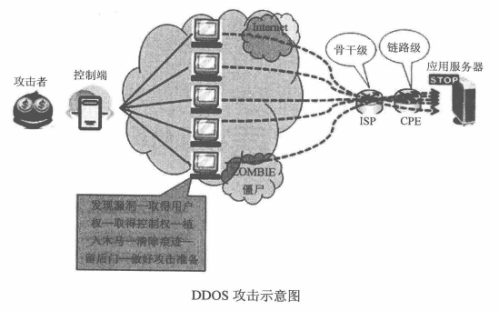

# 问题与简答

## 安全篇

### 跨站脚本攻击(XSS)

跨站脚本攻击(Cross Site Script，简称 XSS)，利用网页开发时留下的漏洞，通过巧妙的方法注入恶意指令代码到网页，使用户加载并执行攻击者恶意制造的网页程序

#### XSS 示例

```php
$input = $_GET["param"];
echo "<div>" . $input . "</div>";
```

```text
https://blog.maplemark.cn/test.php?param=这是一个测试!
https://blog.maplemark.cn/test.php?param=<script>alert(/xss/)</script>
```

#### XSS 分类

- 反射型 XSS：简单地将用户输入的数据反射给浏览器
- 存储型 XSS：把用户输入的数据存储在服务器端
- DOM Based XSS：修改页面 DOM 节点形成的 XSS

#### XSS 防御

- 为 Cookie 设置 HttpOnly，避免 Cookie 被劫持泄露
- 对输入/输出进行检查，明确编码方式

### 跨站点请求伪造(CSRF)

跨站请求伪造(Cross-site request forgery,简称 CSRF)， 是一种挟制用户在当前已登录的 Web 应用程序上执行非本意的操作的攻击方法

#### CSRF 示例

- 在私有域构造页面 P

> https://blog.maplemark.cn/csrf.html

其内容为

```html
<!--仅用于演示，假设该点赞为 GET-->

```

- 诱使目标用户访问页面 P

如果你已经访问过 SF 网站，并且已经登录。可以看到在访问页面 P 之后，已经对 SF 文章进行点赞了

#### CSRF 防御

- 增加验证码(简单有效)
- 检查请求来源是否合法
- 增加随机 token

### SQL 注入

输入的字符串中注入 SQL 指令，若程序当中忽略了字符检查，导致恶意指令被执行而遭到破坏或入侵

#### SQL 注入示例

```php
$id = $_GET['id'];
$sql = "SELECT * FROM `user` WHERE `id`={$id}";
```

将传递参数改为

> 1;DROP TABLE OrdersTable--

#### SQL 注入防御

- 使用预编译语句绑定变量(最佳方式)
- 使用安全的存储过程(也可能存在注入问题)
- 检查输入数据的数据类型(可对抗注入)
- 数据库最小权限原则

### 应用层拒绝服务攻击

#### DDOS 简介

DDOS 又称为分布式拒绝服务，全称是 Distributed Denial of Service。DDOS 本是利用合理的请求造成资源过载，导致服务不可用



网络层 DDOS：伪造大量源 IP 地址，向服务器发送大量 SYN 包，因为源地址是伪造的，不会应答，大量消耗服务器资源(CPU 和内存)

#### 应用层 DDOS

应用层 DDOS，不同于网络层 DDOS，由于发生在应用层，因此 TCP 三次握手已完成，连接已建立，发起攻击的 IP 地址都是真实的

- CC 攻击：对一些消耗资源较大的应用界面不断发起正常的请求，以消耗服务器端资源
- 限制请求频率：在应用中针对每个客户端做一个请求频率的限制

### PHP 安全

#### 文件包含漏洞

include、require、include_once、require_once，使用这 4 个函数包含文件，该文件将作为 PHP 代码执行，PHP 内核不会在意该包含的文件是什么类型

#### 代码执行漏洞

危险函数`exec`、`shell_exec`、`system`可以直接执行系统命令。`eval`函数可以执行 PHP 代码

### 伪随机数和真随机数

#### 伪随机数

通过一些数学算法生成的随机数，并非真正的随机数

#### 真随机数

通过一些物理系统生成的随机数

#### 安全随机数

- Linux

使用 /dev/random 或者 /dev/urandom 来生成随机数，只需读取即可

- PHP

若是支持 openSSL 扩展，可以直接使用函数来生成随机数

```php
openssl_random_pseudo_bytes ( int $length [, bool &$crypto_strong ] ) : string
```
