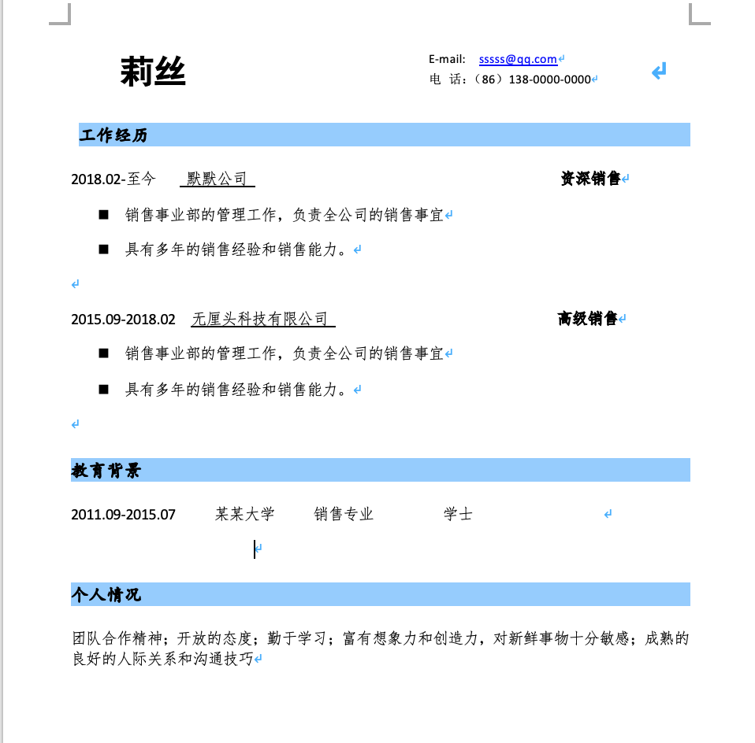
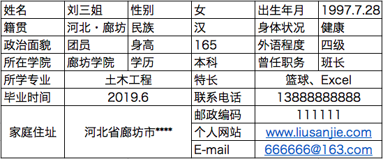
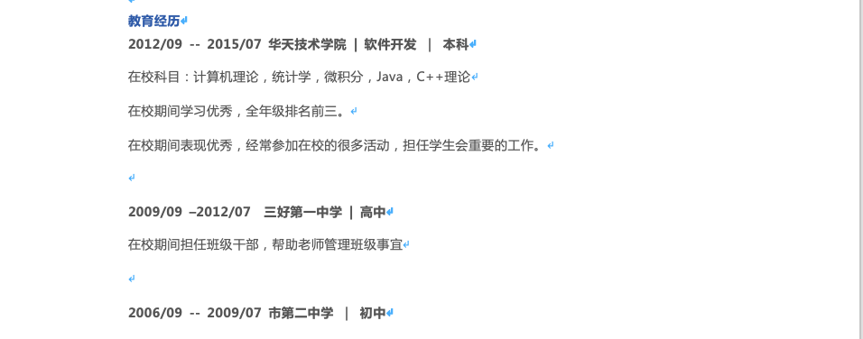

# 设计一份吸引面试官的简历

> 简历是什么？可以理解成：如何花两分钟初步了解你？

## 简历模板

简洁干净的纯色底简历模版可能是最好的选择。面试官也会把更多的注意力放在简历内容上，从而可以更好地判断你的经历是否与工作内容相符。

下面是一个比较清晰的简历模版，可供参考。整体简历的排版清晰；文字描述段落清晰和明确；重点比较突出。

## 组成部分

分为这几部分进行阐述：个人信息、教育情况、工作经历、项目经历、自我评价、其他信息。

### 个人信息

很多小伙伴在构思自己个人信息的时候，很喜欢把自己完全展示出来，如身高、体重、性别、民族、婚姻情况、政治面貌、家庭住址、籍贯等，统统都写在简历上。

但有没有思考过：这些信息是面试官所需要的吗？当然，特殊岗位可能需要提供身高、体重、籍贯、民族或者政治面貌。但是在如今这个互联网公司占据了很大就业市场的情形下，并没有太多的互联网公司在乎这些比较表面的信息，面试官往往更在乎的是姓名有没有写完整、电话号码和邮箱地址是否填写正确等，只有这些信息完整，面试官才可以快速地联系到你。其次面试官也会留意你的求职意向是否与应聘的职位相符，以及期望薪资是否在应聘岗位的范围内等。

上图的简历过于繁琐，罗列的很多个人信息不是 HR 所需要的，而且很难快速地找到个人的联系方式和邮件信息，这样会给招聘人员带来很大的困扰。简单的突出自己的关键信息既可以让招聘人员轻松的获取，也能让招聘人员认为这是一个逻辑清晰的候选人。

### 教育情况

首先，建议求职的小伙伴在教育情况的部分只需要体现出正规被认证的学习经历即可，比如本科、研究生、博士生等的经历。很多小伙伴会将自己的高中，甚至初中的学习经历都要写上，也许你的初中、高中学校在家乡非常有名，但是对于企业来说很难判定和考究。因为学信网可查的学校只有大学院校，所以只需要填写高中毕业后的教育经历就好。

其次，在填写学校经历的时候只需要突出就学时间（入学时间—毕业时间）、学校名称、专业名称、学历（统招或非统招）即可。对于企业方可以很容易通过就学专业和学校判定出来你所学的内容，而不太需要你做过多的说明和解释。经常看到一些刚刚踏入职场的小伙伴在自己学校和专业信息下面会长篇大论地介绍自己的专业以及学习的科目，往往是非常徒劳无功的表现。

最后，部分小伙伴也会分享在校期间获得的所有证书和参与的活动，相信很多面试官在这里的停留不会超过 5 秒，所以，即使展示自己学习有多好也不会吸引太多的注意。倒不如在这里保持一个整洁干净的排版，将自己获得的证书或者参与自己擅长的活动信息挑一些重要的放在最后的其他信息中，这样也能给简历加分。如果觉得这里是否有些单调，可以放一些真正具有含金量的奖项。

### 工作经历

工作经历往往是企业方非常在乎的一部分，这一块也是招聘方停留时间最长的地方。在写工作经历的时候一定要清晰标注这几个内容：公司名称、工作时间（开始时间—结束时间）、职位名称、工作内容、业绩成果。

a. 公司名称。目前很多互联网公司的对外名称和他们的注册名称完全不同，所以在书写公司注册名称的时候建议在后面也标注一下公司的对外名称，也是帮助面试官判定你上一家所在的公司行业和领域，因为很多互联网公司的注册名称普及度并不是很高。

b. 职位名称。公司名称后面建议标注所在公司的职位名称，职位名称可以写上职位的层级 + 具体做的事情，如招聘专员、招聘主管、招聘经理、招聘总监。往往面试官会根据岗位层级看你简历内容负责的事情是否与层级相符，进而来判定你的能力。目前大多数公司内部都有岗位职级，可以在职位名称后面标注上自己目前的职级，以方便面试官清晰的判定。

c. 工作时间。建议具体到年、月，如 2016.07~2019.03，这样的书写方式，面试官可以很清晰的了解你的工作年限。

提示：在写工作时间的时候一定要注意每段工作时间之间的结合期是否连贯。如果没有连贯，且中间相隔的时间周期比较长，最好增加一个说明，为什么会有那么长的空白期、这段时间在做什么等。如果连续几段经历都出现这样的断档，需要慎重思考一下是不是要改变已有的工作习惯。

如果有很多段经历，建议优先写最近的经历，然后采用倒叙的顺序来写比较合适，因为大部分企业方习惯从最近的一份工作去了解。

d. 工作内容。接下来我们聊一下简历中最重要的一个部分，也就是工作内容的描述。我知道很多小伙伴在写职位描述的时候，习惯的做法是借鉴与自己相同岗位的职位 JD，甚至有的小伙伴直接把大公司的职位 JD 粘贴到自己的简历中，表示自己做过相关的工作。但有没有仔细阅读过这些岗位描述？往往企业在发布岗位描述的时候希望招的都是按照最全面的要求去撰写的，但是候选人的能力很少具备全部的要求，如果复制粘贴，很容易被 HR 怀疑简历的真实性。所以最好的做法是在设计简历之前，先认真的思考一下自己上一段的工作内容是什么，然后把这些工作内容按照重要程度依次精简描述出来，写到简历中。

当然，也有小伙伴说：我不太擅长文字的书写怎么办？没关系，如果你已经清晰知道自己的日常工作是什么了，也可以借鉴企业招聘职位中的描述。假设你是一位销售助理，日常的工作为： A.拜访客户与客户进行销售产品的沟通 B.收集客户的资料 C.日常的文档整理、合同的归档。对于 HR 来说，A 和 B 的内容更为重要，所以放在前两条来展现自己日常工作的重要性，两件或多件内容中间要做好分段，描述完一件工作内容后记得另起一段来描述下一个工作职责。

如果有多份工作经历，且工作内容都比较相似的话，最好有一个递进的关系，每一段突出一个工作重点。

来看下下面的一个简历截图，能看出里面的问题吗？

有以下几个问题点：工作时间倒序，并非 HR 的日常阅读习惯；两段工作经历之间留有 1 年时间的空档期，很容易让 HR 表示怀疑；工作描述过于简单，几乎没有突出自己工作的亮点。

e. 业绩成果。如果工作中有过一些公司认可的奖状或者某一期的绩效非常优异的话，可以在“工作内容描述”后面增加一栏“业绩成果的展示”，但是这一栏的内容不易过多，把最重要或者很有价值的公司奖项或绩效按照重要程度精简出 1 ~ 3 条即可，如「公司年度优秀员工奖」、「上季度绩效为 A」等。

### 项目经历

项目经历其实和工作内容描述表现的形式类似，只不过项目经历不用把每段都写在简历里，只需要选出一些自己作为主要参与人或者由自己负责的项目添加在简历里就好了。

项目经历的展示也需要体现出项目名称、项目时间、项目中担任的职务、项目职责和项目业绩。如果补充项目经历的介绍，则会给简历加分，也能更容易打动面试官。

### 自我评价

不要小看自我评价哦，这一部分是上述简历整体的一个总结，大部分面试官很希望从自我评价中整体了解候选人的情况。

所以，建议从两个方面整体的评价自己：首先先对自己过去的工作内容或者过去的学习经历做个总结；然后对自己的个性以及工作态度做一个工作展示。

比如下面的「个人优势」其思路比较清晰：

上面的自我评价是一个可参考的模板：候选人不但突出了自己的优势，而且还清晰地展示了自己的学习主动性和学习能力，进而会给招聘人员留下很好的印象。

### 其他信息

这里如果真的写不出来，可以忽略，当然如果有一些非常值得或者有帮助的奖项亦或培训内容也可以在这里展示，比如某某专栏的发表、CPA 的认证、司法考试的证书等。
