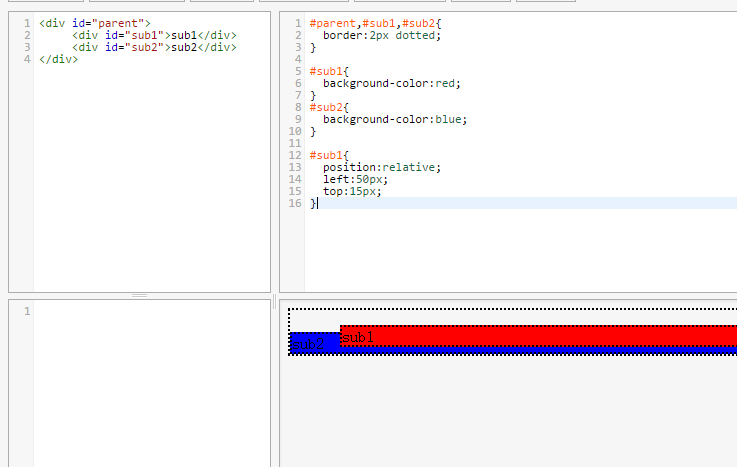
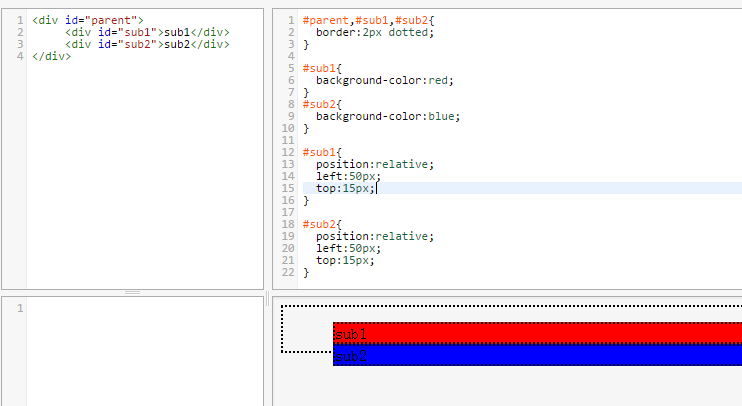
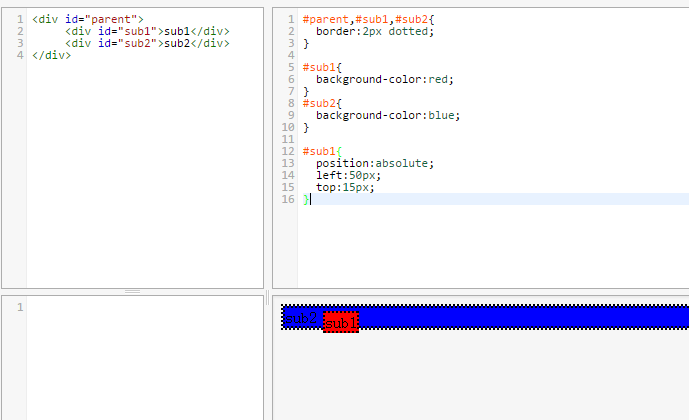
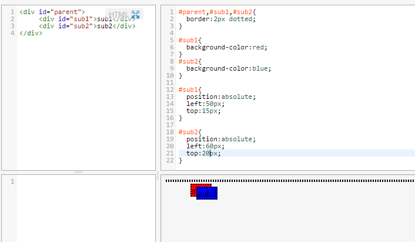

# CSS Position 学习

## CSS Position 有四个属性：

- relative
- absolute
- fixed
- static（默认）

## 样例

```html
<div id="parent">
  <div id="sub1">sub1</div>
  <div id="sub2">sub2</div>
</div>
```

sub1 和 sub2 是同级关系，parent 是它们的父级元素。

## relative（相对定位）

相对定位指的是相对于这个元素原位置的定位，且会占住原来的位置。

所谓原位置指不设置 relative 属性时它的位置（既 static 属性时的位置）

relative 偏移相对的是 margin 的左上侧。

例如对 sub1 设置 relative 属性后，会根据 top，right，bottom，left 属性偏移，而 sub2 的位置不变（sub1 会占住原来的位置）



再对 sub2 设置 relative 属性，它也会相对其原来的位置偏移（sub2 位置还会被占着）



## absolute（绝对定位）

绝对定位是根据其最近进行定位的父对象的 padding 的左上角进行定位，基本分为以下两种情况：

- 例如对 sub1 设置 absolute，如果 sub1 的父级元素（parent 或者其父级元素）设置了 absolute 或 relative，那么 sub1 就会相对这个父元素定位。

- 如果父级元素都没有设置 absolute 或 relative，那 sub1 相对 body 定位。

这时由于 sub1 的位置“腾出来了”，sub2 就会跑到 sub1 的位置（也可以理解 sub1 浮起来了，dreamweaver 中叫做层），它的文档流就会基于 parent。



如果再对 sub2 设置 absolute，那其也是相对 parent 的。



## fixed

fixed 是特殊的 absolute，即 fixed 总是以 body 为定位对象的，按照浏览器的窗口进行定位。

## static（默认）

position 的默认值，一般不设置 position 属性时，会按照正常的文档流进行排列。

**本文转载自 小磊的博客，<a href="http://www.xiaoleilu.com/css-position" rel="nofollow">《CSS Position 学习》</a>**
